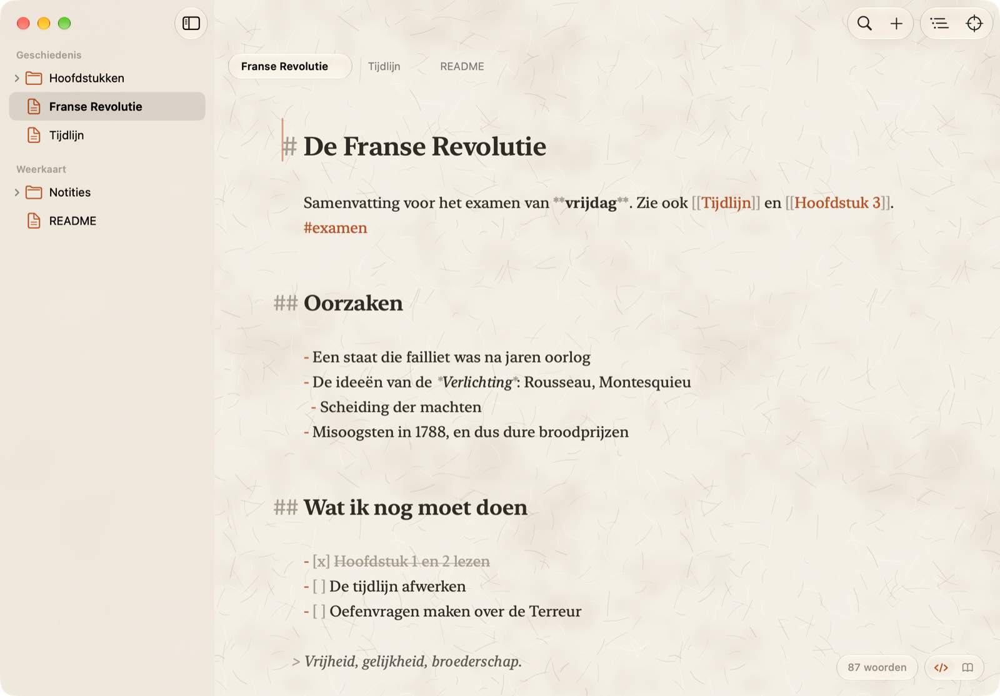
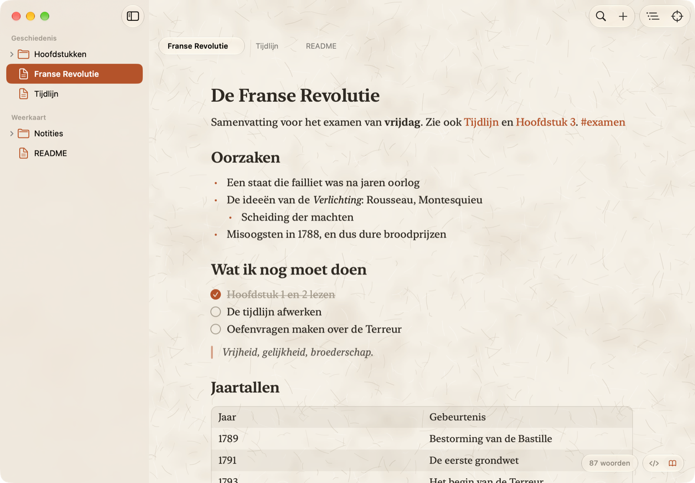
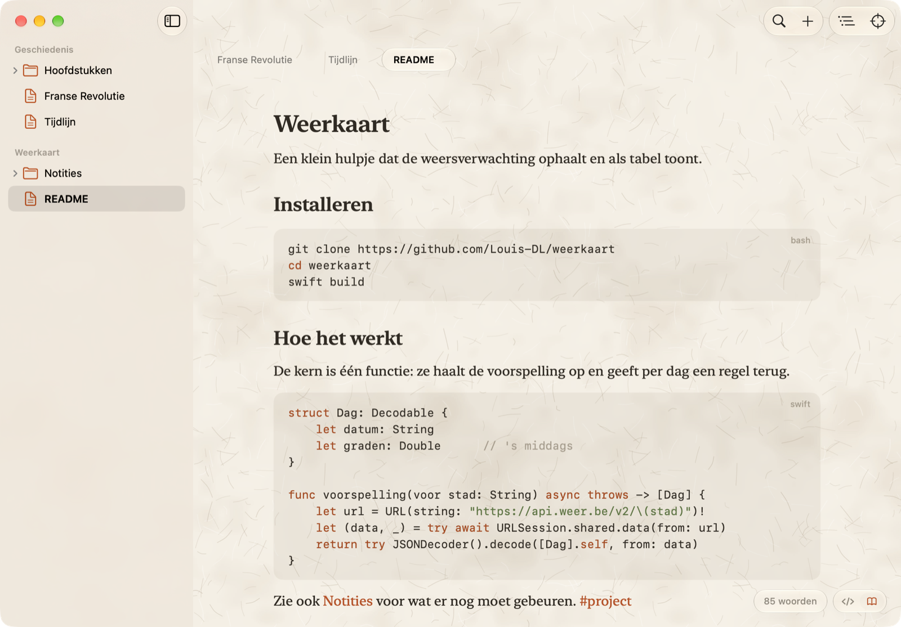
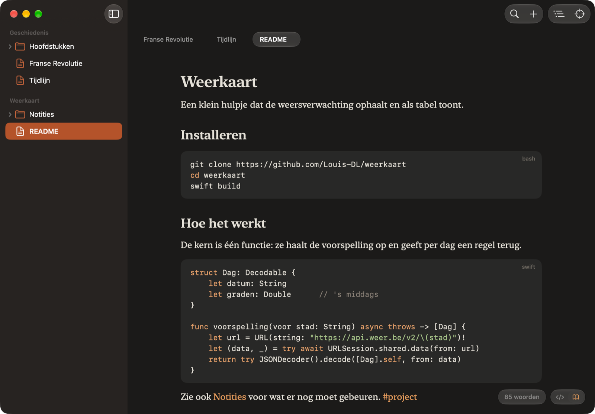
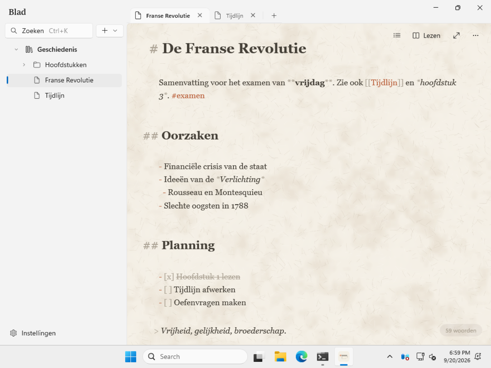

# Blad

Een rustige markdown-editor voor macOS, iPhone en Windows. Voor notities en README's:
de opmaak blijft zichtbaar maar stil, en je pagina's blijven gewone `.md`-bestanden in
gewone mappen.



## Zo ziet het eruit

In leesmodus valt de syntax weg en blijft de tekst staan. Taken vink je hier af.



Codeblokken krijgen kleur, ook in wat je exporteert, en een `#tag` verzamelt pagina's uit al je ruimtes.



Vier thema's: Papier, Licht, Nacht en Automatisch.



Dezelfde app op Windows, met dezelfde bestanden.



## Downloaden

Alles staat bij [Releases](https://github.com/Louis-DL/blad/releases).


- **Mac**: `Blad-1.0.dmg`, open het en sleep Blad naar Programma's. De eerste keer kent macOS
  Blad nog niet: sta het toe bij Systeeminstellingen › Privacy en beveiliging. Vereist macOS 27.
- **Windows**: `Blad-1.0-windows-x64.zip`, uitpakken en `Blad.exe` starten. Installeren hoeft niet.
  Windows toont eerst "Windows heeft uw pc beschermd" omdat de app niet ondertekend is: klik op
  Meer info › Toch uitvoeren. Vereist Windows 10 of 11 (64-bit).
- **iPhone en iPad**: nog geen download. Bouw hem zelf met Xcode (zie hieronder).

## Wat Blad doet

- **Schrijven in markdown**: kopjes, citaten en lijsttekens hangen in de marge, zodat de tekst
  zelf recht blijft staan. De syntax blijft leesbaar, alleen stiller dan je woorden.
- **Ruimtes**: één ruimte per project of vak. Een ruimte is gewoon een map; pagina's zijn
  `.md`-bestanden. Open ze ook in een andere editor, of zet ze in git.
- **Leesmodus** (⌘R): dezelfde pagina zonder syntax, met aanvinkbare taken en "Gelinkt vanuit".
- **Links tussen pagina's** met `[[Pagina]]`, met een lijst van pagina's die terugverwijzen.
- **Tags**: een `#tag` is klikbaar en verzamelt pagina's uit al je ruimtes.
- **Zoeken** tussen pagina's (⌘K) en binnen de open pagina, met vervangen (⌘F).
- **Overzicht** van de kopjes om door een lange pagina te springen (⇧⌘O).
- **Afbeeldingen** plakken, slepen of invoegen; ze komen in een `assets`-map naast je pagina.
- **Kleur in codeblokken** voor onder andere Swift, Python, JavaScript, JSON en shell.
- **Exporteren** als PDF of HTML, en een hele ruimte als één PDF met omslag en inhoud.
- **Focusmodus**, woordenteller, spellingcontrole, en de thema's Papier, Licht, Nacht en Automatisch.

## Sneltoetsen

| | Mac | Windows |
|---|---|---|
| Nieuwe pagina | ⌘N | Ctrl+N |
| Nieuwe ruimte | ⇧⌘N | Ctrl+Shift+N |
| Map openen | ⌘O | Ctrl+O |
| Zoek en open een pagina | ⌘K | Ctrl+K |
| Zoek in de pagina | ⌘F | Ctrl+F |
| Overzicht van de kopjes | ⇧⌘O | Ctrl+Shift+O |
| Leesmodus of bron | ⌘R | Ctrl+R |
| Focusmodus | ⇧⌘F | Ctrl+Shift+F of F11 |
| Afbeelding invoegen | ⇧⌘I | via het menu ⋯ |
| Exporteer als PDF | ⇧⌘E | Ctrl+Shift+E |
| Pagina sluiten | ⌘W | Ctrl+W |
| Instellingen | ⌘, | Ctrl+, |
| Grotere of kleinere tekst | ⌘+ / ⌘− | Ctrl++ / Ctrl+− |

## Je bestanden blijven van jou

Een ruimte is een map, een pagina is een `.md`-bestand, en afbeeldingen staan ernaast in `assets`.
Blad bewaart niets in een eigen database. Zet een ruimte in iCloud Drive of OneDrive en je hebt
dezelfde notities op je Mac, je telefoon en je pc.

## Zelf bouwen

**macOS en iOS** (Xcode 27):

```bash
xcodebuild -project Blad.xcodeproj -scheme Blad -configuration Release build
```

Open `Blad.xcodeproj` voor het schema *Blad* (Mac) of *Blad iOS* (iPhone en iPad). Voor je
eigen toestel moet je bij Signing & Capabilities je eigen team invullen.

**Windows** (.NET 10 SDK, alleen op Windows te bouwen):

```bash
dotnet publish windows/Blad.App/Blad.App.csproj -c Release -r win-x64 -p:Platform=x64 -o publish/Blad
```

**De DMG met eigen achtergrond**:

```bash
scripts/dmg/make-dmg.sh
```

## Hoe het in elkaar zit

| Map | Wat erin zit |
|---|---|
| `Blad/` | De Mac-app: SwiftUI, met een editor op NSTextView |
| `BladiOS/` | Dezelfde app voor iPhone en iPad, op UITextView |
| `Shared/` | Wat beide delen: markdownstijl, leesmodus, links, zoeken, thema's en export |
| `windows/Blad.Core/` | Dezelfde regels in C#, met tests |
| `windows/Blad.App/` | De Windows-app in WinUI 3 |
| `windows/scripts/` | Start Blad op de bouwmachine en maakt schermfoto's |
| `scripts/dmg/` | Bouwt de DMG en tekent de achtergrond |
| `.github/workflows/` | Bouwt Windows, draait de tests en bewaart de schermfoto's |

De drie versies delen geen code met elkaar, maar wel dezelfde regels: hoe markdown gelezen wordt,
hoe links werken en hoe een pagina eruitziet. Wat in `Shared/` in Swift staat, staat in
`windows/Blad.Core/` in C#, met tests die dat gedrag vastleggen.

## Goed om te weten

- De Windows-versie is de jongste van de drie en dus het minst gebruikt.
- De iPhone-versie staat niet in de App Store; je zet hem zelf op je toestel met Xcode.
- Geen automatische updates: nieuwe versies haal je bij Releases.
- De apps zijn niet ondertekend met een betaald certificaat, vandaar de waarschuwing bij de
  eerste start.
